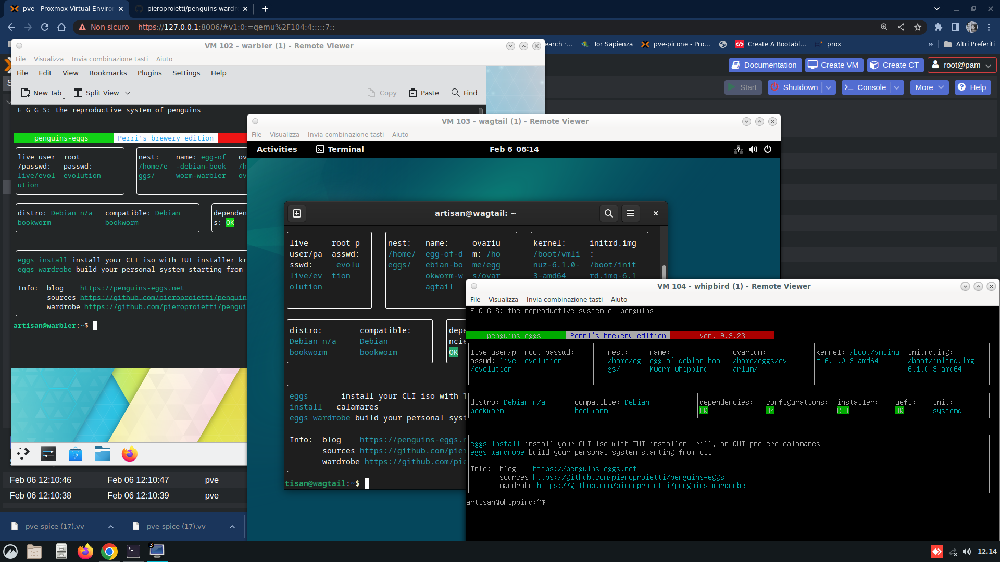

# penguins-wardrobe

Si tratta di un repository costituito principalmente da file yaml e da semplici  script bash ed usato da eggs per creare personalizzazioni di sistemi Linux a partire da una sistema minimale CLI già installato - o nella nostra terminologia "naked" - per ottenere un sistema completo.

Ho utilizzato questo metodo sia per la creazione di alcune personalizzazioni generiche, sia per la creazione di sistemi Linux con waydroid denominati:  wagtail, warbler e whipbird e basati rispettivamente su Gnome, KDE Plasma e Weston.

# La metafora del guardaroba

La metafora consiste in un guardaroba contenente costumi ed accessori per la vestizione.


penguins-wardrobe è una repository per **costumes** ed **accessories**, gestita con Git ed organizzata per directory: costumes, accessories, config, themes e documentation. Il wardrobe permette sia una facile organizzazione del nostro lavoro, sia il consolidamento delle nostre esperienze di customizzatori Linux, rendendo più semplice cercare e riutilizzare il lavoro svolto in precedenza.

E' possibile vestire un sistema CLI con un splendida interfaccia GUI, ma è anche possibile utilizzare il wardrobe per collezionare configurazioni server senza necessariamente avere una interfaccia grafica. 

Questo metodo si è dimostrato utile per lo sviluppo e l'organizzazione del lavoro.

# Costumi

Un costume consiste essenzialmente in una directory denominata con il nome del costume ed un file yaml: index.yaml. 

index.yaml specifica la composizione del costume, a sua definizione la troviamo in [i-materia.ts](https://github.com/pieroproietti/penguins-eggs/blob/master/src/interfaces/i-materia.ts), e viene analizzato dalla classe [tailor.ts](https://github.com/pieroproietti/penguins-eggs/blob/master/src/classes/tailor.ts) di eggs. In sostanza, noi forniamo le indicazioni ed il sarto ci cuce il vestito.

In wardrobe, quindi abbiamo soltanto delle informazioni che specificano soprattutto repository e pacchetti in linguaggio yaml. Questo esempio è tratto dal file index.yaml del mio colibri. Potete visualizzare l'intero [index.yaml](https://github.com/pieroproietti/penguins-wardrobe/blob/main/costumes/colibri/index.yml).

```
# wardrobe: .
# costume: /colibri
---
name: colibri
description: >-
  desktop xfce4 plus all that I need to develop eggs, firmwares and anydesk
  repos
author: artisan
release: 0.9.1
distributions:
  - bookworm
...
  hostname: true
reboot: true
```
La sintassi utilizzata è yaml, piuttosto semplice da leggere, mentre per la scrittura potete contare su numerosi addon per praticamente ogni editor.

Andiamo a vedere come è composto il file index.yaml di un costume.

Possiamo suddividerlo in tre parti:
* [intestazione](#intestazione)
* [sequence](#sequence)
* [customize](#customize)

### intestazione
Definisce il nome, l'autore, descrizione e la release del costume. Una parte importante è ```distributions``` se la distribuzione corrente non è inclusa il costume non verrà applicato.

```
name: colibri
description: >-
  desktop xfce4 plus all that I need to develop eggs, firmwares and anydesk
  repos
author: artisan
release: 0.0.3
distributions:
  - bullseye
  - bookworm
```

## sequence 
La sequence è la parte cruciale sia dei costumi che degli accessori, viene eseguita in sequenza - da qua il nome - e l'idea è stata di renderla minima ed indivisibile. Può contenere:

* [repositories](#repositories)
  * [sources_list](#sources_list)
  * [sources_list_d](#sources_list_d)
* [preinst](#preinst)
* [dependencies](#dependencies)
* [packages](#packages)
* [packages_no_install_recommends](#packages_no_install_recommends)
* [try_packages](#try_packages)
* [try_packages_no_install_recommends](#try_packages_no_install_recommends)
* [debs](#debs)
* [packages_python](#packages_python)
* [accessories](#accessories)
* [try_accessories](#try_accessories)

L'idea dietro la sequenza è stata quella di renderla il più possibile atomica.

Vediamo come è composta in dettaglio la sequenza.

### repositories
Definisce cosa abbiamo bisogno sia nella nostra ```/etc/apt/surces.list``` e principalmente, nella directory ```/etc/apt/sources.list.d```.

```repositories``` è formata da due item:

#### sources_list
Specifica dei componenti da utilizzare: **main**, **contrib**, **non-free**

#### sources_list_d
Specifica dei commandi per aggiungere altre repository all'interno di ```/etc/apt/sources.list.d```.

### preinst
Abbiamo a volte la necessita di eseguire alcune azioni prima dell'installazione dei pacchetti, possiamo aggiungere queste azioni in forma di script in questa sezione.

### packages
Un semplice array di pacchetti da installare, è il cuore del sistema.

### packages_no_install_recommends
Una semplice array di pacchetti da installare con l'opzione ```--no-install-recommends```.

### try_packages
Come [packages](#packages) ma non fallisce se non trova il pacchetto.

### try_packages_no_install_recommends
Come [packages_no_install_recommends](#packages_no_install_recommends) ma non fallisce se non trova il pacchetto.

### debs

Questo è un campo booleano, se è true il contenuto della directory ./debs sarà installato con il comando ```dpkg -i ./debs/*.deb```.

### packages_python
Un semplice array di pacchetti python che saranno installati con pip.

### accessories
Una lista di accessori da installare per completare il costume. esempio:
```
accessories:
- base
- eggs-dev # defined in /accessory
- waydroid # defined in /accessory
- ./firmwares # here we will use an accessory defined inside the costume, note ./
```

### try_accessories
Come  [accessories](#accessories) ma non fallisce.

## customize
costomize contiene le azioni per finalizzare l'installazione e customizzare il risultato. Può contente:
* [dirs](#dirs)
* [hostname](#hostname)
* [scripts](#scripts)

#### dirs
dirs è un campo booleano, se true la directory ./dirs interna al costume verrà copiata nella root del sistema.

Esempio: Abbiamo bisogno di copiare qualcosa in ```/etc/skel```, in ```/usr/share/applications``` ed il nostro background su ```/usr/share/background```. 

Possiamo mettere il tutto in ```dirs```:

```
- dirs   + etc   + skel  
         + usr   + share   + applications + install-to-waydroid.desktop
                           + backgrounds  + waydroid
```
#### hostname
Anche questo è un campo booleano e, se true, il file ```/etc/hostname``` verrà posto con il nome del costume ed in accordo a ciò sarà modificato anche ```/etc/hosts```.

#### scripts
scripts contiene un array di uno o più script utilizzati per customizzare il risulto.

Potete aggiunge altri script e directory all'interno di del costume o utilizzare gli script sotto ```../../scripts/``` come ```../../scripts/config_desktop_link.sh```.

**Esempi**

Gli scripts sono chiamati da ```customize/scripts``` ed eseguiti nell'ordine specifico.

- install-image-from-local.sh (a script to copy system.img and vendor.img from local)
- no-hw-accelleration.sh (script to set waydroid with no-hw-accelleration)

## reboot
Se presente e vero in sistema viene resettato dopo la vestizione.

# Accessories
Gli accessori possono essere definiti all'interno di un costume o fuori dallo stesso - principalmente in ```accessories``` ma anche interni ad un altro costume. Gli accessori interni vivono all'interno di un costume o di altri accessori che li dichiarano.

Hanno la stessa struttura dei costumi e sono chiamati da questi. Potete vederli come una cintura da mettere con dei pantaloni alla moda o una borsa associata al tailler.

Gli accessori possono sia essere installati da soli oppure chiamati da un costume. 

Ad esempio: waydroid è un accessorio ed è utilizzato da wagtail (gnome3) e  warbler (KDE), lo stesso per eggs-dev che viene aggiunto in colibri oppure  firmwares in duck ed owl che hanno bisogno di una maggiore compatibilità hardware.

colibri, wagtail, warbler e whispbird sono fatti per sviluppatori, così usano un accessorio firmwares interno con principalmente driver per wifi.


__Nota__ ```sudo eggs wardrobe wear``` accetta una flag ```--no_firmwares``` per saltare completamente il firmware nel caso stiamo lavorando per macchine virtuali o facendo dei test.

(*) wagtail. warbler e whispbird prima della fine dell'installazione chiamano pure uno speciale script [add_wifi_firmwares.sh](https://github.com/pieroproietti/penguins-wardrobe/blob/main/scripts/add_wifi_firmwares.sh) per aggiungere in Debian bookworm firmware scaricabile da [cdimage unofficial non-free](http://cdimage.debian.org/cdimage/unofficial/non-free/firmware/bookworm/current/).


# I comandi
Abbiamo solo quattro comandi: get, list, show e wear.

## wardrobe get

```
eggs wardrobe get
```

Esegue il clone di [penguins-wardrobe](https://github.com/pieroproietti/penguins-wardrobe) in ```~/.wardrobe```, il comando accetta un argomento [REPO], così potete lavorare con il vostro wardrobe invece di quello standard. Ad esempio:

```
eggs wardrobe https://github.com/quirinux-so/penguins-wardrobe
```

scaricherà in  ```~/.wardrobe``` la versione di quirinux.

## wardrobe list
Mostra la lista dei costumes ed accessories presenti nel wardrobe.

```
eggs wardrobe list 
```

## wardrobe show COSTUME
Mostra l'indice index.yaml di un costume.
```
eggs wardrobe show colibri
```

## sudo wardrobe wear COSTUME
Avvia il processo di vestizione di un costume, alla fine del processo il sistema sarà modificato secondo le indicazioni del costume.

```
sudo eggs wardrobe wear colibri 
```

# Costumi esistenti:
* ```colibri``` is a light XFC4 for developers you can easily start to improve eggs.
* ```duck``` come with cinnamon - probably is the right desktop for peoples coming from windows - here complete plus office, gimp and vlc
* ```owl``` is a XFCE4 for graphics designers, this a simple/experimental bird, based on the work of Charlie Martinez [quirinux](https://blog.quirinux.org/)

* ```wagtail```, a wayland/Gnome/waydroid installation;
* ```warbler```, a wayland/KDE/waydroid installation;
* ```whipbird```: a wayland/weston/waydroid installation.

# Accessories
* base
* eggs-dev
* firmwares
* graphics
* liquorix
* multimedia
* office
* waydroid

# Temi
Mentre i costumi e gli accessori si applicano ad un sistema installato, i temi rendono possibile la customizzazione dell'immagine live. E' possibile customizzare il boot delle immagini iso create con eggs ed l'aspetto dell'installer GUI calamares.

Come per i costumi e gli accessori, i temi sono principalmente costituiti da una directory, file yaml, icone, sfondi e quant'altro necessario. L'idea è stata presa da calamares ed i suoi file di configurazione ed estesa ad aspetti più specifici di eggs come il boot live e, successivamente i costumi e gli accessori. Solo da poco ho deciso di racchiudere anche i temi in wardrobe, inizialmente erano parte di eggs, poi sono stati spostati in penguins-addons, infine con la nascita di penguins-wardrobe sono stati aggiunti ad esso.

E solo scrivento questo questo scritto, mi rendo conto del grande debito nei confronti di calamares che mi ha suggerito prima di passare a yaml per la configurazione di eggs e, poi di utilizzare in maniera estensiva questa metodologia. Spero però che il mio debito possa essere stato ripagato dal fatto di aver denominato krill l'installer CLI interno di eggs.

[educaandos-plus](https://github.com/aosucas499/guadalinex) è stato il primo esempio di un tema esterno disponibile. Altri temi che potete trovare nel wardrobe sono: neon, telos, ufficiozero and waydroid.

## Analizziamo un tema

Un tema consiste in una semplice directory sotto themes, denominata con il nome del vendor (in questo esempio: educanaandos-plus), che include:

```
educaandos-plus/
    theme
        applications
        artwork
        calamares
            branding
            modules
        livecd
```
### themes
E' solo il contenitore di tutto, la radice per così dire del tema stesso. 

Contiene:

#### applications

Solo un link .desktop, verrà copiato in /usr/share/applications/ e sulla cartella Desktop.

#### artwork
L'icona per il tuo link .desktop, verrà copiata in /usr/share/icons/.

#### calamares
Contiene la configurazione per calamares ed è la parte più importante del tema.

I file di configurazione di calamares sono scritti sempre in yaml e contengono la documentazione per le varie optioni. Il principale file di configurazione settings.conf viene automaticamente generato da eggs, solo partition, locale ed users sono attualmente usati da wardrobe.

Per le informazioni di riferimento sulla configurazione di questi file si rimanda al sito di [calamares](https://calamares.is).

##### branding
branding.desc viene generato da eggs, fare riferimento a calamares [branding.desc](https://github.com/calamares/calamares/blob/calamares/src/branding/default/branding.desc) per maggiori informazioni.

##### modules
* [locale.yml](/themes/educaandos-plus/theme/calamares/modules/locale.yml)
* [partitions.yml](/themes/educaandos-plus/theme/calamares/modules/partition.yml)
* [users.yml](/themes/educaandos-plus/theme/calamares/modules/users.yml) (*)

(*) In ```EducaAndOS``` per avere i diritti di amministrazione per l'utente, abbiamo la necessità di configurare lo stesso in un gruppo specifico.

#### livecd
Si prende cura dell'aspetto del boot da live.

Abbiamo in questo casi i temi per [grub](/themes/educaandos-plus/theme/livecd/grub.theme.cfg) ed [isolinux](/themes/educaandos-plus/theme/livecd/isolinux.theme.cfg), nonchè lo [spash](/themes/educaandos-plus/theme/livecd/splash.png) per il boot.

## Uso dei temi
Per essere utilizzato un tema deve essere passato come parametro al flag ```--theme``` in produce:

```
sudo eggs produce --fast --theme ../path/to/theme
```
esempio: 

```
sudo eggs produce --fast  --theme .wardrobe/themes/educaandos-plus
```

Potete anche clonare il wardrobe con Git e prendere il tema da esso:
```
sudo eggs produce --fast  --theme /penguins-wardrobe/themes/educaandos-plus
```

# Config
Questa directory è utilizzata per permettere una customizzazione delle opzioni per l'installazione --unattended. 

```sudo eggs install --unattended``` è equivalente a ```sudo install --custom us``` in questo modo è relativamente facile avere customizzazioni diverse, semplicemente creando un fork di questa repository ed una PR al sottoscritto.

Ad esempio potete copiare us.yaml in bliss.yaml, e cambiare sia il nome dell'utente live che la password ed avere la vostra installazione personalizzazione con:

```sudo eggs install --custom bliss```

Se invece vo serve la customizzazione in italiano:
```sudo eggs install --custom it```

Ovviamente è possibile creare configurazioni a misura per tutti.

# Compatibilità
Utilizzo wardrobe soprattutto per Debian dove si assicura la massima compatibilità, ma anche per Devuan che sostanzialmente ricalca Debian stessa. Qualche aggiunta ed accorgimento, invece, si è reso necessario per includere anche Ubuntu.

## repositories
I Ubuntu abbiamo delle differenze nel sources.list, in particolare cambia il nome dei componenti che passano dai canonici: ```main```, ```contrib```, ```non-free``` alla diversa denominazione di Ubuntu: ```main```, ```restricted```, ```universe``` e ```multiverse```.

In Ubuntu, quindi, sources.list viene semplicemente ignorato, mentre è comunque possibile aggiungere altre repository in source.list.d. Lo stesso avviene per LMDE5 elsie che pur essendo una derivata Debian, ha un source.list dummy e riporta il suo contenuto in source.list.d.

## Gestione delle differenze dei nomi dei pacchetti
Alcuni pacchetti possono essere denominati diversamente Debian/Devuan rispetto ad Ubuntu. Un caso tipico è firefox, ```firefox-esr``` su Debian semplicemente ```firefox``` in Ubuntu. La soluzioni è l'utilizzo della sezione ```try_packages``` dove si possono includere entrambi e si caricherà solo il pacchetto corrispondente.

Lo stesso discorso vale per gli accessori che possono pure essere definiti per distribuzioni diverse, anche qua c'è la possibilità di utilizzare ```try_accessories``` .

## Versioni naked
Un'altra ragione per utilizzare Debian/Devuan invece di Ubuntu e derivate è la difficoltà di ottenere una versione "naked" ovvero una installazione CLI minima. E' possibile con Ubuntu, utilizzando la versione server, ma l'immagine contiene comunque funzionalità non richieste ed è abbastanza pesante rispetto alla controparte Debian.

# Thats all folks!

## Altre informazioni
C'è un manuale [Penguin's eggs official book](https://penguins-eggs.net/book/) ed altra documentazione  - principalmente per sviluppatori - su [penguins-eggs repo](https://github.com/pieroproietti/penguins-eggs) sotto **documents** oltre alla documentazione presente in [penguins-wardrobe](https://github.com/pieroproietti/penguins-wardrobe/DOCUMENTATION) 

* [blog](https://penguins-eggs.net)    
* [facebook penguin's eggs group](https://www.facebook.com/groups/128861437762355/)
* [telegram penguin's eggs channel](https://t.me/penguins_eggs) 
* [twitter](https://twitter.com/pieroproietti)
* [sources](https://github.com/pieroproietti/penguins-krill)

You can contact me at pieroproietti@gmail.com or [meet me](https://meet.jit.si/PenguinsEggsMeeting)

## Copyright and licenses
Copyright (c) 2017, 2023 [Piero Proietti](https://penguins-eggs.net/about-me.html), dual licensed under the MIT or GPL Version 2 licenses.


