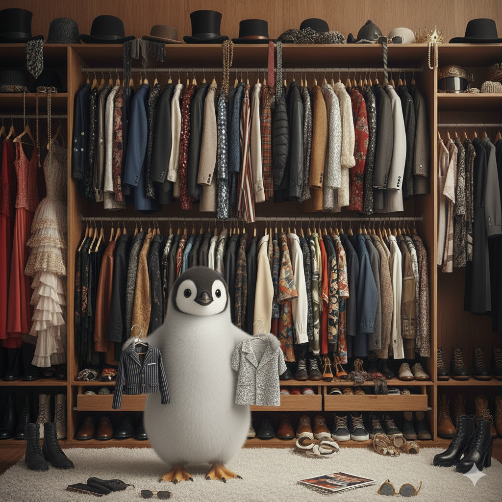

# penguins-wardrobe / v2

This directory contains the **v2 wardrobe definitions**: costumes, accessories, scripts, and vendor configurations used by `penguins-wardrobe` to customize and dress Linux systems.

---

## 📁 Directory Layout
- v2 (wardrobe v2 - actual root)
- **`costumes/`**: Declarative desktop and system environment recipes (e.g. `colibri`, `eagle`, `duck`, `seagull`, `quirinux`).
- **`accessories/`**: Modular components that can be installed alongside costumes or standalone (e.g. `eggs-dev`, `base`, `live-installer`, `firmwares`).
- **`packages.preseed`**: Debconf automatic preseeding files (per costume/accessory) for 100% unattended installations without interactive prompts.
- **`vendors/`**: Vendor-specific customizations and configurations.
- **`scripts/`**: Utility and helper scripts executed during the wardrobe customization sequence.
- **`DOCS/`**: Documentation and guides (see [Wardrobe Users' Guide](./DOCS/wardrobe-users-guide.md)).

---

## 🚀 Quick Usage
You need to install the package [penguins-tailor](https://github.com/pieroproietti/penguins-tailor) and use it to interact with this or your wardrobe.

```bash
# Clone or update the wardrobe repository
tailor get

# List available costumes
tailor list

# Show detailed information about a costume
tailor show colibri

# Apply a costume to the current machine
sudo tailor wear colibri

# Export built packages or execution logs to remote server
tailor export pkg
tailor export log
```

---

## ℹ️ More Information

- **Package Repository**: [github.com/pieroproietti/penguins-tailor](https://github.com/pieroproietti/penguins-tailor)
- **Sample basic wardrobe Repository**: [github.com/pieroproietti/penguins-wardrobe](https://github.com/pieroproietti/penguins-wardrobe)
- **A more advanced wardrobe Repository**: [github.com/charliemartinez/atelier-quirinux](https://github.com/charliemartinez/atelier-quirinux)

- **Website & Documentation**: [penguins-eggs.net](https://penguins-eggs.net)
- **Author**: Piero Proietti <piero.proietti@gmail.com>

---

## 📜 Copyright and License

Copyright (c) 2017-2026 Piero Proietti. Dual licensed under the MIT or GPL Version 2 licenses.

