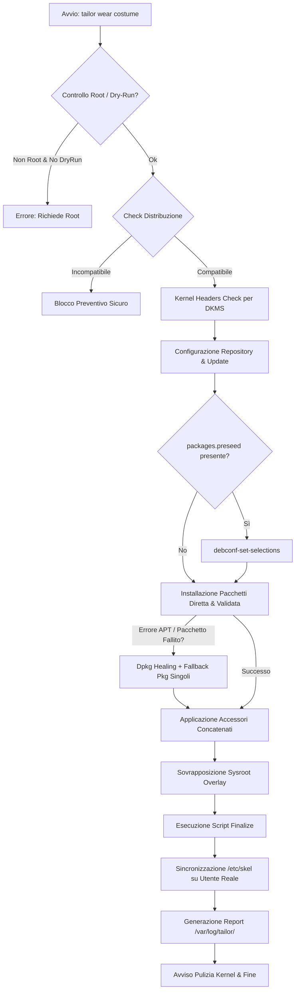

import Translactions from '@site/src/components/Translactions';

<Translactions />

# Penguins' Wardrobe & Tailor - Guida Utente

L'ecosistema di personalizzazione e allestimento delle distribuzioni Linux basato su [Penguins' Eggs](https://penguins-eggs.net) adotta una chiara separazione delle responsabilità:

* **Penguins' Tailor (`tailor`)**: è il "sarto", uno strumento CLI autonomo, moderno e ultra-veloce scritto in **Go**. È il motore esecutivo incaricato di scaricare i repository, interpretare le ricette dichiarative, gestire i pacchetti software, applicare configurazioni di sistema e preparare l'ambiente utente.
* **Penguins' Wardrobe (`penguins-wardrobe`)**: è il "guardaroba", il repository contenente le ricette e le definizioni dichiarative in formato YAML (organizzate sotto la struttura **`v2`**), suddivise in **costumi**, **accessori**, **temi vendor** e **script**.
* **Penguins' Eggs (`eggs`)**: è lo strumento di rimasterizzazione e creazione di immagini ISO avviabili. Il precedente comando integrato `eggs wardrobe` è stato rimosso da Eggs per delegare interamente l'allestimento del sistema al nuovo binario dedicato `tailor`.

Grazie a **Tailor** e **Wardrobe**, è possibile trasformare qualsiasi installazione Linux minimale da riga di comando (definita *naked*) in un sistema desktop o server completo, rifinito e pronto all'uso quotidiano o alla successiva rimasterizzazione in formato Live ISO.

---

## 👔 La metafora del sarto e del guardaroba

L'architettura si basa sulla metafora di un vero e proprio atelier sartoriale:

```
~/.wardrobe/v2/
├── costumes/       # I Costumi (ambienti desktop e configurazioni di sistema complete)
├── accessories/    # Gli Accessori (componenti e pacchetti software modulari)
├── vendors/        # I Temi/Vendor (branding per Calamares, Plymouth, LiveCD)
├── scripts/        # Script bash riutilizzabili di sistema e configurazione
└── DOCS/           # Documentazione e guide
```

* **Il Sarto (`tailor`)**: l'eseguibile che "prende le misure" dell'hardware e della distribuzione in uso, scarica il guardaroba e applica i vestiti desiderati. Può lavorare con il guardaroba ufficiale (`penguins-wardrobe`) oppure con atelier/guardaroba personalizzati di terze parti.
* **Costumes (`v2/costumes/`)**: sono gli "abiti completi". Rappresentano ricette complete per allestire un Desktop Environment (XFCE, Cinnamon, MATE, GNOME, ecc.) o una configurazione tematica (es. `colibri`, `duck`, `eagle`, `quirinux`, `chicks`, `gypaetus`, `seagull`).
* **Accessories (`v2/accessories/`)**: sono gli "accessori" modulari (cinture, borse, scarpe). Possono essere inclusi all'interno di un costume o applicati singolarmente (es. `eggs-dev`, `firmwares`, `flatpak`, `graphics`, `kvm`, `liquorix`, `office`, `multimedia`, `waydroid`).
* **Preseed Debconf (`packages.preseed`)**: file posizionabile all'interno di **ogni costume o accessorio** per preconfigurare in modo del tutto automatico le risposte Debconf (tramite `debconf-set-selections`), eliminando qualsiasi richiesta o finestra interattiva a video durante l'installazione dei pacchetti.
* **Auto-discovery Pacchetti (`packages.yaml`)**: file opzionale per dichiarare elenchi estesi o modulari di pacchetti separati dalla ricetta YAML principale.
* **Vendors (`v2/vendors/`)**: contengono le personalizzazioni grafiche e di branding per il boot live (GRUB, Isolinux) e per l'installer grafico [Calamares](https://calamares.io) (moduli, branding, partizionamento, utenti).
* **Scripts (`v2/scripts/`)**: script bash riutilizzabili per configurare display manager (LightDM, GDM, SDDM), collegamenti sul desktop, hostname e servizi di sistema.
* **Sysroot Overlay (`sysroot` o `dirs`)**: directory presente all'interno di ciascun costume o accessorio che riproduce la gerarchia del filesystem reale (es. `etc/skel/`, `usr/share/backgrounds/`). Durante l'applicazione viene sovrapposta a `/` preservando attributi e permessi.

---

## 📦 Installazione e Compilazione di Penguins' Tailor

Il comando `tailor` viene fornito dal pacchetto **`penguins-tailor`**.

### 1. Compilazione da sorgenti (Go)

È possibile compilare e installare `penguins-tailor` su qualsiasi distribuzione Linux dotata dell'ambiente di compilazione Go (versione 1.22 o superiore):

```bash
git clone https://github.com/pieroproietti/penguins-tailor.git
cd penguins-tailor
make
sudo make install
```

Il binario `tailor` verrà installato in `/usr/local/bin/tailor`.

### 2. Creazione pacchetti nativi di distribuzione

`tailor` integra un tool di packaging multipiattaforma (`tailor tools build`). Per generare il pacchetto nativo per la tua distribuzione (`.deb` per Debian/Ubuntu, `PKGBUILD`/`.pkg.tar.zst` per Arch Linux, `.rpm` per Fedora/openSUSE, `.apk` per Alpine):

```bash
# Eseguire da utente standard (NON come root)
tailor tools build
```

### 3. Configurazione dei Repository Ufficiali

È possibile configurare o rimuovere con facilità i repository ufficiali di `penguins-eggs.net` e le relative chiavi GPG per il gestore di pacchetti del sistema in uso (APT, Pacman, DNF, Zypper, APK):

```bash
# Aggiunge il repository ufficiale e le chiavi GPG
sudo tailor tools repo add

# Rimuove il repository e le chiavi GPG
sudo tailor tools repo rm
```

---

## 🚀 Guida ai Comandi CLI (`tailor`)

Il comando principale è **`tailor`**. Di seguito la guida dettagliata a tutte le funzionalità disponibili:

### 1. `tailor get [url] [-b branch]`
Scarica o aggiorna il repository del guardaroba nella cartella `~/.wardrobe` dell'utente reale.

```bash
# Clona o aggiorna il guardaroba ufficiale (default: pieroproietti/penguins-wardrobe)
tailor get

# Utilizza un guardaroba personalizzato o di terze parti
tailor get https://github.com/charliemartinez/penguins-wardrobe

# Specifica un branch alternativo
tailor get https://github.com/charliemartinez/penguins-wardrobe -b develop
```

* Se `~/.wardrobe` non esiste, viene eseguito un `git clone`. Se esiste già, viene eseguito un `git pull` per aggiornare costumi, accessori e script all'ultima versione.
* **Flag:**
  * `-u, --url <url>`: URL del repository Git del guardaroba.
  * `-b, --branch <branch>`: Branch Git da clonare o aggiornare.

---

### 2. `tailor list`
Elenca tutti i costumi disponibili nel guardaroba locale (`~/.wardrobe/v2/costumes`), mostrandone il nome, la descrizione e l'atelier di origine.

```bash
tailor list
```

*Esempio di output:*
```text
👗 AVAILABLE COSTUMES
Costumes and recipes from atelier: https://github.com/pieroproietti/penguins-wardrobe

  • albatros     : Desktop versatile per diverse architetture
  • chicks       : Configurazione leggera ed educativa per bambini e scuole
  • colibri      : Desktop XFCE4 leggero, ottimizzato per lo sviluppo
  • duck         : Desktop Cinnamon rifinito, ideale per chi proviene da Windows
  • eagle        : Ambiente completo con supporto multi-architettura
  • gypaetus     : Configurazione base minimale per server o sistemi headless
  • quirinux     : Distribuzione per produzione multimediale e animazione
  • seagull      : Desktop essenziale e performante
```

---

### 3. `tailor show <costume>`
Mostra i metadati dettagliati di uno specifico costume o accessorio: autore, versione, distribuzioni supportate, accessori inclusi, anteprima pacchetti e comandi di sequenza/finalizzazione.

```bash
tailor show colibri
```

È possibile ispezionare direttamente anche un accessorio:
```bash
tailor show eggs-dev
# oppure indicando il percorso relativo
tailor show accessories/eggs-dev
```

---

### 4. `tailor wear <costume>`
Avvia il processo di **"vestizione"** del sistema applicando il costume scelto. Questo comando richiede privilegi di amministratore (`sudo` o utente root).

```bash
sudo tailor wear colibri
```

Durante l'esecuzione, `tailor wear` adotta automaticamente un layout a **schermo diviso orizzontale (Split Screen TUI)**:
* **Pannello superiore**: Mostra in tempo reale l'atelier di provenienza, il costume in lavorazione, il branch attivo, la fase corrente e l'elenco degli step completati con successo `[OK]`.
* **Pannello inferiore (Console Interattiva)**: Mostra lo stream in tempo reale dei comandi (`apt-get`, `dpkg`, script di sistema) mantenendo lo standard input (`stdin`) attivo per consentire la risposta a prompt debconf o licenze interattive.

```
┌─ TAILOR WEAR ────────────────────────────────────────────────────────┐
│ Atelier : https://github.com/pieroproietti/penguins-wardrobe        │
│ Costume : Costume: colibri (v2.0.1)                                  │
│ Branch  : main                                                       │
│ Step    : [OK] Kernel headers verified                               │
│           [OK] Sources list configured                               │
│           [OK] Repositories updated                                  │
│           --> [1/3] Accessory: base                                  │
│           --> [2/3] Accessory: eggs-dev                              │
└──────────────────────────────────────────────────────────────────────┘
Reading package lists... Done
Building dependency tree... Done
```

#### Opzioni disponibili (Flags):
* `-b, --branch <branch>`: Seleziona o clona preventivamente un branch specifico del guardaroba prima di applicare il costume.
* `-n, --dry-run` (alias `--simulate`): Esegue una simulazione completa dell'installazione senza apportare modifiche al sistema (non richiede privilegi di root).
* `--no-acc`: Salta l'installazione di tutti gli accessori dichiarati nel costume.
* `--no-firm`: Salta l'installazione degli accessori legati ai firmware hardware proprietari.
* `--linear` (alias `--no-split`): Disabilita l'interfaccia a schermo diviso TUI e utilizza l'output lineare standard (utile in contesti di log automatizzati o CI/CD).

```bash
# Esempio: simulazione senza modifiche
tailor wear colibri --dry-run

# Esempio: applica il costume colibri escludendo i firmware proprietari
sudo tailor wear colibri --no-firm

# Esempio: applica direttamente un singolo accessorio modulare
sudo tailor wear eggs-dev
sudo tailor wear accessories/multimedia
```

---

### 5. `tailor export` (Esportazione remota via SSH)
La suite `tailor export` permette di trasferire pacchetti compilati e file di log su un server remoto configurato tramite connessioni SSH multiplexate veloci e sicure.

#### Esportare pacchetti di distribuzione (`tailor export pkg`):
Invia i pacchetti compilati (`.deb`, `.rpm`, `.pkg.tar.zst`, `.apk`) al server di storage remoto (predefinito: `root@192.168.1.2:/eggs/`):

```bash
tailor export pkg

# Con pulizia preventiva dei vecchi pacchetti sul server remoto:
tailor export pkg --clean
```

#### Esportare log e report di esecuzione (`tailor export log`):
Raccoglie il log principale (`/var/log/tailor.log`) e l'ultimo report dettagliato di wear (`/var/log/tailor/tailor-report-*.txt`) caricandoli sul server di destinazione:

```bash
# Esportazione con parametri predefiniti
tailor export log

# Esportazione verso host e percorso personalizzati
tailor export log -u artisan -i 192.168.1.50 -d /home/artisan/logs
```

* **`-u, --user`**: Utente SSH remoto (default: `artisan`).
* **`-i, --ip`**: Indirizzo IP o hostname remoto (default: `192.168.1.2`).
* **`-d, --dir`**: Directory di destinazione sul server remoto (default: `/home/artisan`).

---

### 6. `tailor version`
Mostra la versione del binario `tailor` in uso.

```bash
tailor version
```

---

## 🧬 Anatomia di un Costume v2 (`index.yaml` o `<distro>.yaml`)

Tutti i costumi risiedono in `~/.wardrobe/v2/costumes/<nome>/` e gli accessori in `~/.wardrobe/v2/accessories/<nome>/`. Ciascuno di essi è governato da un file descrittivo in formato YAML.

Il motore di Tailor ricerca il file di configurazione secondo il seguente ordine di priorità:
1. `index.yaml` / `index.yml`
2. `<distro_id>.yaml` (es. `debian.yaml`, `ubuntu.yaml`, `devuan.yaml`, `arch.yaml`, `alpine.yaml`, `fedora.yaml`, `opensuse.yaml`)

Ecco un esempio completo e reale basato sul costume `colibri`:

```yaml
---
name: colibri
description: "Desktop XFCE4 leggero con strumenti completi per lo sviluppo"
author: artisan
release: 2.0.1

# Elenco dei codename di distribuzioni supportate
distributions:
  - bookworm
  - trixie
  - daedalus
  - excalibur

# Sequenza atomica di preparazione e installazione pacchetti
sequence:
  repositories:
    sources_list:
      - main
      - contrib
      - non-free
      - non-free-firmware
    sources_list_d:
      - "curl -fsSL https://download.docker.com/linux/debian/gpg | gpg --dearmor -o /etc/apt/keyrings/docker.gpg"
    update: true
    upgrade: true

  # Pacchetti standard installati via gestore pacchetti
  packages:
    - firefox-esr
    - libxfce4ui-utils
    - lightdm
    - lightdm-gtk-greeter
    - network-manager-gnome
    - pipewire-pulse
    - thunar
    - xfce4-panel
    - xfce4-session
    - xfce4-settings
    - xfdesktop4
    - xfwm4

  # Pacchetti minimi installati con flag --no-install-recommends
  packages_no_install_recommends:
    - plymouth
    - plymouth-themes

  # Pacchetti con prompt interattivi (licenze EULA, debconf)
  packages_interactive:
    - ttf-mscorefonts-installer

  # Accessori da applicare in sequenza
  accessories:
    - base
    - eggs-dev
    - ./firmwares  # accessorio locale interno al costume

  # Comandi intermedi eseguiti prima della finalizzazione
  cmds:
    - echo "Preparazione completata"

# Finalizzazione e personalizzazione del sistema
finalize:
  customize: true  # Applica l'overlay sysroot/ su /
  cmds:
    - "../../scripts/config_desktop_link.sh"
    - "../../scripts/config_lightdm.sh"
    - "../../scripts/hostname.sh"
    - "plymouth-set-default-theme bgrt"
    - "update-initramfs -u"

# Segnala se il costume richiede un riavvio al termine
reboot: true

# Mostra avviso multilingua sulla configurazione del display manager LightDM
display_manager_notice: true
```

---

### Dettaglio delle Sezioni YAML

#### 1. Header e Compatibilità (`distributions`)
* **`name`**: Nome identificativo del costume o accessorio.
* **`description`**: Breve spiegazione delle funzionalità fornite.
* **`author` / `release`**: Autore e versione della ricetta.
* **`distributions`**: Elenco dei codename di distribuzioni supportate (es. `bookworm`, `trixie`, `daedalus`, `excalibur`).
  > [!IMPORTANT]
  > **Controllo preventivo di compatibilità**: prima di toccare qualsiasi configurazione o pacchetto, `tailor` confronta il valore di `VERSION_CODENAME` in `/etc/os-release` con l'elenco `distributions`. Se il sistema non è supportato, l'esecuzione viene interrotta istantaneamente e in totale sicurezza (con esecuzione opzionale dello script di controllo `tailor-check` se presente).

#### 2. Auto-Discovery dei Pacchetti Esterni (`packages.yaml`)
* Se nella directory del costume o dell'accessorio è presente un file `packages.yaml` o `packages.yml`, `tailor` ne scopre e carica automaticamente i pacchetti fondendoli con la lista principale senza duplicati.

#### 3. Preseed Debconf Automatico (`packages.preseed`) - Zero Interazione

Durante l'installazione di determinati pacchetti su distribuzioni basate su Debian (Debian, Devuan, Ubuntu, Linux Mint, ecc.), APT e DPKG possono invocare `debconf` per porre domande all'utente tramite interfacce testuali (TUI). Queste interruzioni bloccano i processi di installazione non presidiati (*unattended*) o automatizzati. Esempi frequenti:
* Scelta del Display Manager predefinito (LightDM, SDDM, GDM3).
* Accettazione obbligatoria di contratti di licenza firmware (es. Wi-Fi Intel `firmware-ipw2x00`, `b43-fwcutter`) o font proprietari (`ttf-mscorefonts-installer`).
* Selezione del layout di tastiera, charset della console e codepage (`keyboard-configuration`, `console-setup`).
* Configurazione dei backend di stampa (`cups`, `libpaper`), firewall (`ufw`), o autorizzazioni di cattura pacchetti per utenti non-root (`wireshark-common`).

Per eliminare radicalmente qualsiasi necessità di interazione umana, `penguins-tailor` supporta la presenza di un file **`packages.preseed`** all'interno della directory di **qualsiasi costume o accessorio**.

##### Funzionamento in Tailor
1. **Rilevamento e Isolamento Modulare**: Prima di installare i pacchetti di un costume o di un accessorio, `tailor` controlla se nella rispettiva cartella esiste `packages.preseed`. Ogni costume/accessorio dichiara esclusivamente le risposte per i pacchetti che include, garantendo isolamento, componibilità e pulizia.
2. **Iniezione Debconf Preventiva**: Su sistemi Debian/Devuan/Ubuntu, `tailor` verifica che il tool `debconf-set-selections` sia disponibile (installando automaticamente il pacchetto `debconf-utils` se assente) ed applica le risposte nel database di configurazione Debconf prima del lancio di APT.
3. **Installazione Silenziosa**: APT (`apt-get install` con `DEBIAN_FRONTEND=noninteractive`) procede all'installazione trovando le risposte già impostate, senza mostrare alcun prompt o bloccare l'esecuzione.

##### Formato delle Direttive
Il file `packages.preseed` utilizza la sintassi nativa di Debconf, strutturata in 4 campi separati da spazi o tabulazioni:
```text
<proprietario/pacchetto> <nome-template-debconf> <tipo-dato> <valore>
```
* **`<proprietario/pacchetto>`**: Nome del pacchetto Debian o namespace condiviso (es. `lightdm`, `firmware-ipw2x00`, `cups`).
* **`<nome-template-debconf>`**: Identificatore della domanda o template Debconf.
* **`<tipo-dato>`**: Tipo di dato atteso (`boolean`, `select`, `multiselect`, `string`, `password`, `note`).
* **`<valore>`**: Risposta da preimpostare (es. `true`, `false`, `lightdm`, `a4`, `accept`).

##### Esempi Pratici di Preseeding

* **Display Manager predefinito (LightDM / SDDM):**
  ```text
  lightdm shared/default-x-display-manager select lightdm
  ```

* **Accettazione Licenze Firmware Non-Free (Wi-Fi Intel & Broadcom):**
  ```text
  firmware-ipw2x00 firmware-ipw2x00/license/accepted boolean true
  firmware-ipw2x00 firmware-ipw2x00/license/type select accept
  firmware-ivtv firmware-ivtv/license/accepted boolean true
  firmware-b43-installer firmware-b43-installer/license/accepted boolean true
  firmware-b43legacy-installer firmware-b43legacy-installer/license/accepted boolean true
  b43-fwcutter b43-fwcutter/install_non_free boolean true
  ```

* **Accettazione EULA Microsoft TrueType Core Fonts:**
  ```text
  ttf-mscorefonts-installer msttcorefonts/accepted-mscorefonts-eula boolean true
  ```

* **Cattura Pacchetti Wireshark per Utenti Normali:**
  ```text
  wireshark-common wireshark-common/install-setuid boolean true
  ```

* **Server di Stampa CUPS e Formato Pagina:**
  ```text
  libpaper libpaper/defaultpaper select a4
  cups cups/raw-print boolean true
  cups cups/backends multiselect lpd, socket, usb, snmp, dnssd
  ```

* **Dizionari, Lingua e Tastiera:**
  ```text
  console-setup console-setup/charmap47 select UTF-8
  keyboard-configuration keyboard-configuration/layoutcode string it
  dictionaries-common dictionaries-common/default-ispell select italian (Italian)
  dictionaries-common dictionaries-common/default-wordlist select italian (Italian)
  ```

* **Firewall UFW e Aggiornamenti Automatici:**
  ```text
  ufw ufw/enable select true
  unattended-upgrades unattended-upgrades/enable_auto_updates boolean false
  ```

##### 💡 Come Estrarre le Risposte Debconf da un Sistema Esistente
Per individuare facilmente le chiavi Debconf di un pacchetto installato da inserire nel file `packages.preseed`:

```bash
# Ispeziona le risposte correnti memorizzate nel database debconf
debconf-show <nome-pacchetto>

# Estrai le righe già formattate pronte da copiare in packages.preseed
sudo debconf-get-selections | grep "^<nome-pacchetto>"
```

#### 4. Sequenza (`sequence`)
* **`repositories`**:
  * `sources_list`: Abilita i rami di componenti desiderati (`main`, `contrib`, `non-free`, `non-free-firmware`).
  * `sources_list_d`: Comandi shell per aggiungere chiavi GPG e repository PPA o di terze parti.
  * `update`: Esegue l'aggiornamento degli indici dei repository (`apt-get update`).
  * `upgrade`: Esegue l'upgrade del sistema in modalità non interattiva sicura.
* **`packages`**: Array di pacchetti standard installati direttamente con pre-validazione della cache e ripristino automatico in caso di errore.
* **`packages_no_install_recommends`**: Pacchetti installati con `--no-install-recommends` per mantenere il sistema snello.
* **`packages_interactive`**: Pacchetti che necessitano di interazione (accettazione licenze proprietarie EULA, configurazioni debconf). Vengono eseguiti preservando lo standard I/O reale del terminale.
* **`accessories`**: Elenco di accessori da concatenare (globali come `base` o relativi come `./firmwares`).

#### 5. Finalizzazione (`finalize`)
* **`customize: true`**: Copia ricorsivamente il contenuto della directory `sysroot/` (o `dirs/`) all'interno della root del sistema (`/`) preservando attributi e permessi.
* **`cmds`**: Array di comandi e script eseguiti nell'ordine indicato. I percorsi relativi (es. `../../scripts/config_lightdm.sh` o `scripts/myscript.sh`) vengono risolti ed eseguiti correttamente rispetto alla struttura `v2/`.

---

## 🛡️ Affidabilità, Resilienza e Self-Healing

`penguins-tailor` implementa avanzati meccanismi di sicurezza per garantire che l'applicazione dei costumi sia robusta, riproducibile e a prova di errore:



### 1. Installazione Diretta, Pre-validazione e Fallback Atomico
`tailor` installa direttamente l'insieme dei pacchetti software richiesti, ottimizzando drasticamente la velocità di esecuzione ed eliminando l'overhead della vecchia suddivisione a lotti (*batching*):
* **Pre-validazione APT Cache**: prima di invocare APT, `tailor` confronta l'elenco dei pacchetti richiesti con l'indice dei pacchetti disponibili nei repository, segnalando preventivamente quelli mancanti o non reperibili senza bloccare l'intero processo.
* **Self-Healing e Ripristino Automatico**: qualora l'installazione globale incontri un errore (es. conflitti temporanei o dipendenze rotte), `tailor` ripara automaticamente lo stato di `dpkg` (`dpkg --configure -a` e `apt-get install -f`) e ritenta l'installazione pacchetto per pacchetto in modalità atomica. In questo modo un singolo pacchetto difettoso o mancante non interrompe l'allestimento del costume.

### 2. Protezione DKMS preventiva
I pacchetti che utilizzano DKMS falliscono se gli header del kernel in esecuzione non sono presenti. `tailor` rileva il kernel corrente (`uname -r`) e installa preventivamente i pacchetti `linux-headers-$(uname -r)` e `linux-headers-<arch>`, evitando blocchi durante l'unpacking dei moduli kernel per schede video o di rete.

### 3. Sincronizzazione `/etc/skel` per l'utente reale
Quando `customize: true` copia le configurazioni in `/etc/skel/`, `tailor` rileva l'utente non-root che ha invocato il comando (`SUDO_USER` o il primo utente reale con UID $\ge 1000$) e sincronizza la sua home directory con i permessi e la proprietà corretti (`chown`), evitando che file o cartelle rimangano di proprietà di `root`.

### 4. Report Dettagliati e Logging
Ogni operazione viene registrata nel log di sistema `/var/log/tailor.log`. Al termine del comando `wear`, viene generato un report strutturato con timestamp in `/var/log/tailor/tailor-report-YYYYMMDD-HHMMSS.txt` contenente:
* Pacchetti installati con successo.
* Pacchetti che non è stato possibile installare o reperire.

### 5. Preseeding Debconf a Zero Interazione
Per ogni costume o accessorio applicato, `tailor` verifica preventivamente la presenza di `packages.preseed`. Le risposte debconf vengono caricate nel database di sistema prima che `apt-get` avvii l'installazione dei pacchetti, assicurando che nessun prompt interattivo (accettazione licenze, scelta del display manager, layout di tastiera) blocchi l'esecuzione o richieda l'intervento dell'utente.

---

## 🌐 Distribuzioni Supportate (Debian & Arch Linux)

`penguins-tailor` include un filtro preventivo all'avvio basato su **`FamilyID`** (rilevato tramite `/etc/os-release` e le gerarchie di sistema):

* **Famiglia Debian (`familyId: "debian"`)**:
  * Include: **Debian**, **Devuan**, **Ubuntu**, **Linux Mint**, **Quirinux**, e derivate.
  * Pieno supporto nativo per l'installazione diretta via `apt-get`, risoluzione delle dipendenze, iniezione debconf (`packages.preseed`), DKMS headers e script di configurazione.
* **Famiglia Arch Linux (`familyId: "archlinux"`)**:
  * Include: **Arch Linux**, **Manjaro**, e derivate.
  * Architettura predisposta con supporto alle ricette `arch.yaml` (già disponibili per diversi accessori come `educational`, `eggs-dev`, `office`, `waydroid`). La gestione nativa dei pacchetti via `pacman` è in fase di sviluppo e costituisce la base per le prossime estensioni modulari dell'ecosistema.
* **Altre Distribuzioni**:
  * Se invocato su sistemi non appartenenti alle famiglie `debian` o `archlinux`, `tailor` interrompe immediatamente l'esecuzione in totale sicurezza, proteggendo il sistema da modifiche incoerenti.

> [!NOTE]
> La precedente generazione di file `AIPrompt.txt` per la conversione esterna dei pacchetti è stata dismessa in favore di una gestione dichiarativa nativa e strutturata all'interno delle ricette `<distro>.yaml`.

---

## 🎨 Catalogo Costumi ed Accessori

### Costumi Principali (`v2/costumes/`)

| Costume | Ambiente Desktop | Caratteristiche Principali |
| :--- | :--- | :--- |
| **`colibri`** | XFCE4 | Desktop snello e ultra-reattivo, ideale per workstation di sviluppo e macchine con risorse moderate. |
| **`duck`** | Cinnamon | Interfaccia moderna e intuitiva in stile Windows/Mint, fornita con suite LibreOffice, GIMP e VLC. |
| **`eagle`** | Multi-DE / MATE | Configurazione flessibile ed estesa, testata anche per architetture ARM64. |
| **`chicks`** | Educativo / Leggero | Ambiente giocoso, colorato e sicuro con software per la didattica e la scuola primaria. |
| **`quirinux`** | XFCE4 / Pro | Distribuzione specializzata per produzione multimediale, grafica 2D/3D e animazione (basata su Devuan/Debian). |
| **`gypaetus`** | Base minimale | Configurazione essenziale per server e sistemi headless senza interfaccia grafica. |
| **`seagull`** | Essenziale | Desktop essenziale, moderno e performante. |
| **`albatros`** | Personalizzato | Varianti ottimizzate per architetture e requisiti specifici. |

### Accessori Modulari (`v2/accessories/`)

| Accessorio | Descrizione |
| :--- | :--- |
| **`base`** | Pacchetti essenziali di sistema, utilità di base e supporto clipboard/guest agent `spice-vdagent`. |
| **`educational`** | Suite di pacchetti didattici e per l'apprendimento scolastico. |
| **`eggs-dev`** | Strumenti completi per lo sviluppo di Penguins' Eggs e Tailor (Node.js, Go, VS Code, Git, build-essential). |
| **`firmwares`** | Pacchetto completo di firmware per schede di rete Wi-Fi, Ethernet, CPU AMD/Intel e schede grafiche. |
| **`firmwares-light`** | Versione ridotta e mirata dei firmware più comuni. |
| **`flatpak`** | Supporto Flatpak e integrazione con il repository Flathub. |
| **`graphics`** | Suite di grafica e disegno: Blender, GIMP, Inkscape, Krita, Darktable. |
| **`kvm`** | Virtualizzazione completa tramite QEMU/KVM e interfaccia `virt-manager`. |
| **`liquorix`** | Installazione automatica del kernel Liquorix a bassa latenza, ideale per audio/video real-time. |
| **`live-installer`** | Integrazione dell'installer di sistema grafico Calamares. |
| **`multimedia`** | Codec audio/video, Audacity, OBS Studio, VLC media player. |
| **`nextcloud`** | Client di sincronizzazione desktop per Nextcloud. |
| **`office`** | Suite d'ufficio completa LibreOffice, font Microsoft e visualizzatori PDF. |
| **`waydroid`** | Installazione e configurazione dell'ambiente container Android Waydroid. |

---

## 🛠️ Guida Pratica: Creare un Nuovo Costume v2

Creare un costume personalizzato nella nuova struttura `v2` richiede pochi semplici passaggi:

### Passo 1: Creare la struttura delle cartelle
All'interno del proprio repository o in `~/.wardrobe/v2/costumes/` crea la nuova cartella:

```bash
mkdir -p ~/.wardrobe/v2/costumes/my-desktop
cd ~/.wardrobe/v2/costumes/my-desktop
mkdir -p sysroot/etc/skel/.config sysroot/usr/share/backgrounds scripts
```

### Passo 2: Definire il file `index.yaml`
Crea il file `index.yaml` specificando i requisiti:

```yaml
name: my-desktop
description: "Il mio desktop personalizzato basato su XFCE"
author: "Il Tuo Nome"
release: 1.0.0
distributions:
  - bookworm
  - trixie

sequence:
  repositories:
    sources_list:
      - main
      - contrib
      - non-free
      - non-free-firmware
    update: true
  packages:
    - xfce4
    - lightdm
    - lightdm-gtk-greeter
    - firefox-esr
    - network-manager-gnome
  accessories:
    - base
    - multimedia

finalize:
  customize: true
  cmds:
    - "../../scripts/config_lightdm.sh"
    - "scripts/setup_theme.sh"
```

### Passo 2b: Eliminare le interazioni con `packages.preseed` (Opzionale)
Se il costume o l'accessorio include pacchetti che normalmente richiedono risposte interattive (come la scelta del Display Manager, l'accettazione di contratti EULA di font o firmware non-free), crea il file `packages.preseed` nella cartella del costume per automatizzare completamente la procedura:

```bash
cat << 'EOF' > ~/.wardrobe/v2/costumes/my-desktop/packages.preseed
# Imposta automaticamente LightDM come Display Manager predefinito
lightdm shared/default-x-display-manager select lightdm

# Accetta le licenze dei driver proprietari senza bloccare l'installazione
firmware-ipw2x00 firmware-ipw2x00/license/accepted boolean true
firmware-ipw2x00 firmware-ipw2x00/license/type select accept
EOF
```

### Passo 3: Aggiungere file e configurazioni in `sysroot`
Inserisci i file di configurazione del desktop (es. pannelli XFCE, icone, sfondi) dentro `sysroot/etc/skel/` e gli sfondi in `sysroot/usr/share/backgrounds/`.

### Passo 4: Testare il Costume
Esegui la simulazione o l'applicazione del costume sul sistema:

```bash
# Test simulato
tailor wear my-desktop --dry-run

# Applicazione reale
sudo tailor wear my-desktop
```

---

## 🔄 Il Flusso di Lavoro con Penguins' Eggs

Con la rimozione del comando `wardrobe` da `penguins-eggs`, il ciclo di vita per la creazione di distribuzioni Linux personalizzate è ora perfettamente modulare:

```
[ Installazione Base Naked (CLI) ]
               │
               ▼
   tailor get [url] [-b branch]
   sudo tailor wear <costume>
               │
               ▼
[ Test e Personalizzazione Locale ]
               │
               ▼
     sudo eggs produce --theme ...
               │
               ▼
   [ Immagine ISO Live Pronta! ]
```

1. **Installazione Base**: Installa Debian, Devuan o Ubuntu in modalità minimale (solo console, senza desktop environment).
2. **Allestimento con Tailor**:
   ```bash
   tailor get
   sudo tailor wear colibri
   ```
3. **Verifica e Test**: Riavvia il computer per verificare l'avvio del desktop environment, del display manager e delle configurazioni dell'utente. Al riavvio, rimuovi eventuali vecchi pacchetti kernel non più necessari.
4. **Rimasterizzazione con Eggs**: Crea l'immagine ISO Live avviabile e installabile con Penguins' Eggs:
   ```bash
   sudo eggs produce --theme vendors/educaandos-plus
   ```

---

## 🤖 Creare Costumi con l'Intelligenza Artificiale

La sintassi dichiarativa in YAML di `penguins-wardrobe` e `penguins-tailor` è ideale per essere generata o modificata tramite assistenti AI come **Antigravity**.

### Esempio di Prompt per l'AI:
> *"Crea una ricetta `index.yaml` per penguins-wardrobe v2 destinata a Debian Bookworm/Trixie con desktop environment MATE, browser Chromium, suite LibreOffice, media player VLC, abilitazione dei componenti contrib e non-free-firmware, inclusione degli accessori base e firmwares, e script di finalizzazione per la configurazione di LightDM."*

L'assistente AI genererà la configurazione completa, ottimizzerà la lista dei pacchetti e preparerà gli script di configurazione compatibili con la struttura `v2/`.

---

## 📜 Licenza e Crediti

* **Autore**: Piero Proietti <piero.proietti@gmail.com>
* **Collaborazioni & Ringraziamenti**: Un ringraziamento speciale a **[Charlie Martínez](https://github.com/charliemartinez)** ([Quirinux](https://quirinux.org)) per il prezioso supporto, il continuo testing e la stretta collaborazione nello sviluppo e sperimentazione di `penguins-tailor`.
* **Sito Ufficiale**: [penguins-eggs.net](https://penguins-eggs.net)
* **Codice Sorgente Tailor**: [github.com/pieroproietti/penguins-tailor](https://github.com/pieroproietti/penguins-tailor)
* **Codice Sorgente Wardrobe**: [github.com/pieroproietti/penguins-wardrobe](https://github.com/pieroproietti/penguins-wardrobe)
* **Licenza**: Dual licensed under MIT License / GPL v2.
