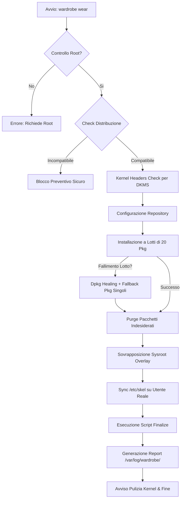

import Translactions from '@site/src/components/Translactions';

<Translactions />

# Penguins' Wardrobe - Guida Utente

**Penguins' Wardrobe** è uno strumento autonomo, moderno e leggero scritto in **Go**, progettato per gestire e applicare configurazioni di sistema, ambienti desktop, temi e pacchetti software (denominati **"costumi"** e **"accessori"**) su distribuzioni Linux.

Nato originariamente all'interno dell'ecosistema di rimasterizzazione [Penguins' Eggs](https://penguins-eggs.net), `penguins-wardrobe` è oggi un binario indipendente (`wardrobe`) che permette di trasformare una distribuzione minimale da riga di comando (definita *naked*) in un sistema desktop o server completo, rifinito e pronto all'uso o alla successiva rimasterizzazione in formato ISO.

---

## 👔 La metafora del guardaroba

Il concetto alla base di **Wardrobe** è quello di un vero e proprio guardaroba organizzato:

```
~/.wardrobe/v2/
├── costumes/       # I Costumi (ambienti completi)
├── accessories/    # Gli Accessori (componenti modulari)
├── vendors/        # I Temi/Vendor (branding Calamares, Plymouth, LiveCD)
├── scripts/        # Script condivisi di sistema e configurazione
└── DOCS/           # Documentazione e guide
```

* **Costumes (`costumes`)**: sono gli "abiti completi". Rappresentano ricette esaustive per allestire un desktop environment (XFCE, Cinnamon, GNOME, Mate, ecc.) o un server tematico (es. `colibri`, `duck`, `eagle`, `quirinux2`, `chicks`).
* **Accessories (`accessories`)**: sono le "cinture, borse o scarpe". Componenti modulari che possono essere abbinati a un costume o installati da soli (es. `eggs-dev` per l'ambiente di sviluppo, `firmwares`, `flatpak`, `kvm`, `liquorix`, `office`, `multimedia`).
* **Vendors (`vendors`)**: contengono le personalizzazioni visive del boot live (GRUB, Isolinux) e dell'installer grafico [Calamares](https://calamares.io) (branding, moduli, partizionamento, utenti).
* **Scripts (`scripts`)**: script bash riutilizzabili per configurare display manager, collegamenti sul desktop, hostname e servizi di sistema.
* **Sysroot Overlay (`sysroot` o `dirs`)**: una cartella presente all'interno di un costume o accessorio che riproduce la gerarchia del filesystem reale (es. `etc/skel/`, `usr/share/backgrounds/`). Durante l'applicazione viene sovrapposta a `/` preservando attributi e permessi.

---

## 📦 Installazione e Compilazione

### 1. Compilazione da sorgenti

È possibile compilare e installare `penguins-wardrobe` su qualsiasi distribuzione Linux con Go installato:

```bash
git clone https://github.com/pieroproietti/penguins-wardrobe.git
cd penguins-wardrobe
make
sudo make install
```

Il binario `wardrobe` verrà installato in `/usr/local/bin/wardrobe`.

### 2. Creazione pacchetti nativi di distribuzione

`wardrobe` integra un tool di packaging multipiattaforma (`wardrobe tools build`). Per generare il pacchetto nativo per la tua distribuzione (`.deb` per Debian/Ubuntu, `PKGBUILD`/`.pkg.tar.zst` per Arch Linux, `.rpm` per Fedora/openSUSE, `.apk` per Alpine):

```bash
# Eseguire da utente normale (NON da root)
wardrobe tools build
```

---

## 🚀 Guida ai Comandi CLI

Il comando principale è `wardrobe`. Di seguito l'elenco completo delle funzionalità:

### 1. `wardrobe get`
Scarica o aggiorna il repository dei costumi nella cartella nascosta dell'utente `~/.wardrobe`.

```bash
wardrobe get
```

Se `~/.wardrobe` non esiste, viene eseguito un `git clone`. Se esiste già, viene eseguito un `git pull` per aggiornare tutti i costumi, gli accessori e gli script alle ultime versioni disponibili.

---

### 2. `wardrobe list`
Elenca tutti i costumi disponibili nel guardaroba locale, indicandone il nome e la descrizione.

```bash
wardrobe list
```

*Esempio di output:*
```text
Available costumes in penguins-wardrobe:
- albatros    : Desktop versatile per diverse architetture
- chicks      : Configurazione leggera ed educativa per bambini e scuole
- colibri     : Desktop XFCE4 leggero, ottimizzato per lo sviluppo
- duck        : Desktop Cinnamon rifinito, ideale per chi proviene da Windows
- eagle       : Ambiente completo con supporto multi-architettura
- gypaetus    : Configurazione base minimale
- quirinux2   : Distribuzione multimediale e per animatori grafici (Devuan/Debian)
- seagull     : Desktop essenziale e performante
```

---

### 3. `wardrobe show <costume>`
Mostra i dettagli e i metadati di uno specifico costume o accessorio: descrizione, distribuzioni supportate, pacchetti richiesti, accessori collegati e comandi di finalizzazione.

```bash
wardrobe show colibri
```

È possibile ispezionare anche un accessorio specifico:
```bash
wardrobe show accessories/eggs-dev
```

---

### 4. `wardrobe wear <costume>`
Avvia il processo di **"vestizione"** del sistema. Questo comando richiede privilegi di amministratore (`sudo` o utente root).

```bash
sudo wardrobe wear colibri
```

Durante la vestizione, `wardrobe wear` adotta automaticamente un layout a **schermo diviso orizzontale**:
* **Pannello superiore**: Mostra in modo chiaro e fisso il banner del costume, gli accessori e lo stato di avanzamento delle fasi `[OK]`.
* **Pannello inferiore (Console Interattiva)**: Mostra lo stream in tempo reale dei comandi (`apt-get`, `dpkg`) e mantiene la tastiera attiva (`stdin`) per rispondere a eventuali prompt o conferme debconf.

#### Opzioni disponibili (Flags):
* `--no-acc`: Salta l'installazione di tutti gli accessori dichiarati nel costume.
* `--no-firm`: Salta l'installazione degli accessori legati ai firmware hardware proprietari.

```bash
# Esempio: applica il costume colibri senza firmware proprietari
sudo wardrobe wear colibri --no-firm
```

È anche possibile applicare direttamente un singolo accessorio:
```bash
sudo wardrobe wear eggs-dev
# oppure
sudo wardrobe wear accessories/multimedia
```

---

### 5. `wardrobe export` (Esportazione remota via SSH)
La suite di comandi `export` consente di trasferire comodamente pacchetti e log su un server remoto configurato tramite connessioni SSH multiplexate veloci e sicure.

#### Esportare pacchetti di distribuzione (`wardrobe export pkg`):
Invia i pacchetti compilati (`.deb`, `.rpm`, `.pkg.tar.zst`, `.apk`) al server di storage remoto (predefinito: `root@192.168.1.2:/eggs/`):

```bash
wardrobe export pkg

# Con pulizia preventiva delle versioni precedenti sul server remoto:
wardrobe export pkg --clean
```

#### Esportare log e report di esecuzione (`wardrobe export log`):
Raccoglie il file di log principale (`/var/log/wardrobe.log`) e l'ultimo report dettagliato di wear (`/var/log/wardrobe/wardrobe-report-*.txt`) caricandoli sul server di destinazione:

```bash
# Esportazione con parametri predefiniti
wardrobe export log

# Esportazione personalizzata
wardrobe export log -u artisan -i 192.168.1.50 -d /home/artisan/logs
```

* **`-u, --user`**: Utente SSH remoto (default: `artisan`).
* **`-i, --ip`**: Indirizzo IP o hostname remoto (default: `192.168.1.2`).
* **`-d, --dir`**: Directory di destinazione sul server remoto (default: `/home/artisan`).

---

### 6. `wardrobe version`
Mostra la versione attuale del programma compilato.

```bash
wardrobe version
```

---

## 🧬 Anatomia di un Costume (`index.yaml` o `<distro>.yaml`)

Ogni costume o accessorio risiede in una propria directory ed è governato da un file descrittivo in formato YAML. Il motore di Wardrobe cerca i file secondo il seguente ordine di priorità:
1. `index.yaml` / `index.yml`
2. `<distro_id>.yaml` (es. `debian.yaml`, `ubuntu.yaml`, `arch.yaml`, `alpine.yaml`, `fedora.yaml`, `opensuse.yaml`)

Ecco un esempio completo basato sul costume `colibri`:

```yaml
---
name: colibri
description: "Desktop XFCE4 leggero con strumenti completi per lo sviluppo"
author: artisan
release: 2.0.1

# Elenco delle distribuzioni / codename supportati
distributions:
  - bookworm
  - trixie
  - daedalus
  - excalibur

# Gestione dichiarativa autoritativa (opzionale)
# packages_manifest: packages.list

# Sequenza atomica di preparazione e installazione
sequence:
  repositories:
    sources_list:
      - main
      - contrib
      - non-free
      - non-free-firmware
    sources_list_d:
      - "curl -fsSL https://download.docker.com/linux/debian/gpg | gpg --dearmor -o /etc/apt/keyrings/docker.gpg"
    update: true
    upgrade: true

  # Pacchetti standard installati via APT
  packages:
    - firefox-esr
    - libxfce4ui-utils
    - lightdm
    - lightdm-gtk-greeter
    - network-manager-gnome
    - pipewire-pulse
    - thunar
    - xfce4-panel
    - xfce4-session
    - xfce4-settings
    - xfdesktop4
    - xfwm4

  # Pacchetti minimi senza dipendenze raccomandate
  packages_no_install_recommends:
    - plymouth
    - plymouth-themes

  # Pacchetti con prompt interattivi (debconf, licenze EULA)
  packages_interactive:
    - ttf-mscorefonts-installer

  # Pacchetti da rimuovere esplicitamente
  packages_remove:
    - slim
    - xterm

  # Accessori da applicare in sequenza
  accessories:
    - base
    - eggs-dev
    - ./firmwares  # accessorio locale interno al costume

  # Comandi intermedi eseguiti prima della finalizzazione
  cmds:
    - echo "Preparazione completata"

# Finalizzazione e personalizzazione del sistema
finalize:
  customize: true  # Applica l'overlay sysroot/ su /
  cmds:
    - "../../scripts/config_desktop_link.sh"
    - "../../scripts/config_lightdm.sh"
    - "../../scripts/hostname.sh"
    - "plymouth-set-default-theme bgrt"
    - "update-initramfs -u"

# Segnala se il costume richiede un riavvio al termine
reboot: true

# Mostra avviso multilingua sulla configurazione del display manager
display_manager_notice: true
```

---

### Dettaglio delle Sezioni YAML

#### 1. Header e Compatibilità (`distributions`)
* **`name`**: Nome identificativo del costume.
* **`description`**: Breve spiegazione delle funzionalità fornite.
* **`author` / `release`**: Autore e versione della ricetta.
* **`distributions`**: Elenco dei codename di distribuzioni supportate (es. `bookworm`, `trixie`, `daedalus`, `resolute`).
  > [!IMPORTANT]
  > **Controllo preventivo di compatibilità**: prima di toccare qualsiasi configurazione o pacchetto, `wardrobe` confronta il valore di `VERSION_CODENAME` in `/etc/os-release` con l'elenco `distributions`. Se il sistema non è supportato, l'esecuzione viene interrotta istantaneamente e in totale sicurezza.

#### 2. Gestione Dichiarativa dei Pacchetti (`packages_manifest`)
* **`packages_manifest`**: Consente di definire un file di testo (es. `packages.list` o l'output di `dpkg -l` / `dpkg-query -W`) contenente l'elenco esatto e autoritativo dei pacchetti desiderati.
* **Risoluzione per distribuzione**: Se nella directory del costume è presente un file con suffisso `_<codename>-packages.list` (es. `debian_bookworm-packages.list` o `quirinux_daedalus-packages.list`), `wardrobe` lo individua e lo applica automaticamente.
* **`packages_install_file`**: File esterno contenente un elenco aggiuntivo di pacchetti da installare.
* **`packages_remove_file`**: File esterno con l'elenco di pacchetti da rimuovere/purgare.

#### 3. Preseed Debconf Automatico (`packages.preseed`)
* **`packages.preseed`**: Se presente nella cartella del costume o dell'accessorio, `wardrobe` applica automaticamente le risposte debconf tramite `debconf-set-selections` prima dell'installazione dei pacchetti. Questo file deve essere usato con parsimonia ed essere mirato **esclusivamente** ai pacchetti forniti da quel costume o accessorio (es. impostare LightDM in `quirinux-desktop`, accettare licenze firmware in `firmwares/network-wifi` o `quirinux-firmware`), mantenendo le ricette YAML completamente pulite.

#### 4. Sequenza (`sequence`)
* **`repositories`**:
  * `sources_list`: Abilita i rami di componenti desiderati (`main`, `contrib`, `non-free`, `non-free-firmware`).
  * `sources_list_d`: Comandi shell per inserire nuove repository PPA o di terze parti.
  * `update`: Esegue `apt-get update`.
  * `upgrade`: Esegue `apt-get upgrade` in modalità non interattiva sicura.
* **`packages`**: Array di pacchetti standard installati con gestione a blocchi e ripristino automatico.
* **`packages_no_install_recommends`**: Pacchetti installati con flag `--no-install-recommends` per mantenere il sistema snello.
* **`packages_interactive`**: Pacchetti che necessitano di interazione (accettazione licenze proprietarie, domande debconf). Vengono eseguiti preservando lo standard I/O reale del terminale.
* **`packages_remove`**: Pacchetti incompatibili o indesiderati da disinstallare con `apt-get purge`.
* **`accessories`**: Elenco di accessori da concatenare (possono essere globali come `base` o locali con percorso relativo come `./firmwares`).

#### 5. Finalizzazione (`finalize`)
* **`customize: true`**: Copia ricorsivamente il contenuto della directory `sysroot/` (o `dirs/`) all'interno della root del sistema (`/`) usando `rsync -aAXv`.
* **`cmds`**: Array di comandi e script eseguiti nell'ordine indicato. Se il primo parametro corrisponde a un file di script relativo (es. `../../scripts/config_lightdm.sh` o `scripts/myscript.sh`), viene risolto ed eseguito correttamente.

---

## 🛡️ Affidabilità, Resilienza e Self-Healing

`penguins-wardrobe` implementa avanzati meccanismi di sicurezza per garantire che l'applicazione dei costumi sia robusta, riproducibile e a prova di errore:



### 1. Installazione a lotti (Batching) e Fallback Atomico
L'installazione di centinaia di pacchetti in un'unica invocazione `apt` può causare picchi di CPU e memoria durante l'esecuzione dei trigger di `dpkg` (aggiornamento initramfs, compilazioni DKMS, cache icone/MIME). `wardrobe` suddivide l'elenco in lotti controllati di **20 pacchetti**:
* Ogni lotto completato è salvato permanentemente su disco.
* Se un lotto incontra un errore, `wardrobe` ripara lo stato (`dpkg --configure -a` e `apt-get install -f`) e ritenta l'installazione pacchetto per pacchetto. In questo modo un singolo pacchetto difettoso o mancante non compromette l'intera installazione.

### 2. Protezione DKMS preventiva
I pacchetti che usano DKMS falliscono se gli header del kernel in esecuzione non sono presenti. `wardrobe` rileva il kernel corrente (`uname -r`) e installa preventivamente i pacchetti `linux-headers-$(uname -r)` e `linux-headers-<arch>`, evitando blocchi durante l'unpacking dei driver video o di rete.

### 3. Rete di Sicurezza (`neverPurgeBase`)
La rimozione dichiarativa dei pacchetti non potrà **mai** disinstallare componenti essenziali del sistema operativo. `wardrobe` protegge sempre:
* Gestori di pacchetti: `dpkg`, `apt`, `ca-certificates`.
* Sistema di base e Init: `systemd`, `sysvinit`, `libc6`, `coreutils`, `bash`, `util-linux`.
* Kernel in esecuzione: il pacchetto `linux-image-$(uname -r)` attivo.
* Bootloader: `grub-pc`, `grub-efi-amd64`, `initramfs-tools`.
* Connettività: `openssh-server`, `network-manager`.
* Strumenti di sistema: `penguins-wardrobe`, `wardrobe`, `penguins-eggs`.

### 4. Sincronizzazione `/etc/skel` per l'utente reale
Quando `customize: true` copia le configurazioni in `/etc/skel/`, `wardrobe` rileva l'utente non-root che ha invocato il comando (`SUDO_USER` o il primo utente reale con UID $\ge 1000$) e sincronizza la sua home directory con i permessi e la proprietà corretti (`chown`), senza lasciare file appartenenti a `root`.

### 5. Report Dettagliati e Logging
Ogni operazione viene registrata in `/var/log/wardrobe.log`. Al termine del comando `wear`, viene generato un report strutturato con timestamp in `/var/log/wardrobe/wardrobe-report-YYYYMMDD-HHMMSS.txt` contenente:
* Pacchetti installati con successo.
* Pacchetti rimossi dal sistema.
* Pacchetti che non è stato possibile installare o reperire.
* Pacchetti non rimovibili.

---

## 🌐 Supporto per Distribuzioni Non-Debian (`AIPrompt.txt`)

Sebbene l'ecosistema principale sia focalizzato su distribuzioni basate su Debian e derivate (Devuan, Ubuntu, Linux Mint, Quirinux, ecc.), `penguins-wardrobe` include il supporto per l'identificazione di distribuzioni **Arch Linux**, **Manjaro**, **Alpine**, **Fedora** e **openSUSE**.

Qualora `wardrobe wear` venga eseguito su un sistema privo di `apt-get`:
1. Rileva la distribuzione e la famiglia di appartenenza via `/etc/os-release`.
2. Esegue un'analisi dell'hardware grafico (GPU e controller 3D) e delle sessioni desktop disponibili in `/usr/share/xsessions/`.
3. Genera un file `AIPrompt.txt` nella cartella Home dell'utente con tutte le informazioni necessarie per richiedere a un assistente AI (come **Antigravity** o modelli LLM) la conversione immediata dei pacchetti per il gestore (`pacman`, `apk`, `dnf`, `zypper`).

---

## 🎨 Catalogo Costumi ed Accessori

### Costumi Principali

| Costume | Ambiente Desktop | Caratteristiche Principali |
| :--- | :--- | :--- |
| **`colibri`** | XFCE4 | Desktop snello e ultra-reattivo, ideale per workstation di sviluppo e macchine con risorse moderate. |
| **`duck`** | Cinnamon | Interfaccia moderna e intuitiva in stile Windows/Mint, fornita con suite LibreOffice, GIMP e VLC. |
| **`eagle`** | Multi-DE / Mate | Configurazione flessibile ed estesa, testata anche per architetture ARM64. |
| **`chicks`** | Educativo / Leggero | Ambiente giocoso, colorato e sicuro con software per la didattica e la scuola. |
| **`quirinux2`** | XFCE4 / Pro | Distribuzione specializzata per produzione multimediale, grafica 2D/3D e animazione (basata su Devuan/Debian). |
| **`gypaetus`** | Base minimale | Configurazione essenziale per server e sistemi headless. |
| **`albatros`** | Personalizzato | Varianti ottimizzate per architetture e requisiti specifici. |

### Accessori Modulari

| Accessorio | Descrizione |
| :--- | :--- |
| **`base`** | Pacchetti essenziali di sistema, utilità di base e supporto per clipboard/guest agent `spice-vdagent`. |
| **`eggs-dev`** | Strumenti completi per lo sviluppo di Penguins' Eggs e Wardrobe (Node.js, Go, VS Code, Git, build-essential). |
| **`firmwares`** | Pacchetto completo di firmware per schede di rete Wi-Fi, Ethernet, CPU AMD/Intel e schede grafiche. |
| **`firmwares-light`** | Versione ridotta e mirata dei firmware più comuni. |
| **`flatpak`** | Supporto Flatpak e integrazione con il repository Flathub. |
| **`graphics`** | Suite di grafica e disegno: Blender, GIMP, Inkscape, Krita, Darktable. |
| **`kvm`** | Virtualizzazione completa tramite QEMU/KVM e interfaccia `virt-manager`. |
| **`liquorix`** | Installazione automatica del kernel Liquorix a bassa latenza, ideale per audio/video real-time. |
| **`live-installer`** | Integrazione dell'installer di sistema grafico Calamares. |
| **`multimedia`** | Codec audio/video, Audacity, OBS Studio, VLC media player. |
| **`office`** | Suite d'ufficio completa LibreOffice, font Microsoft e visualizzatori PDF. |
| **`waydroid`** | Installazione e configurazione del container Android Waydroid. |

---

## 🛠️ Guida Pratica: Creare un Nuovo Costume

Creare un costume personalizzato è semplice e richiede pochi passaggi:

### Passo 1: Creare la struttura delle cartelle
All'interno del proprio repository o in `~/.wardrobe/v2/costumes/` crea una nuova cartella:

```bash
mkdir -p ~/.wardrobe/v2/costumes/my-desktop
cd ~/.wardrobe/v2/costumes/my-desktop
mkdir -p sysroot/etc/skel/.config sysroot/usr/share/backgrounds scripts
```

### Passo 2: Definire il file `index.yaml`
Crea il file `index.yaml` specificando i requisiti:

```yaml
name: my-desktop
description: "Il mio desktop personalizzato basato su XFCE"
author: "Il Tuo Nome"
release: 1.0.0
distributions:
  - bookworm
  - trixie

sequence:
  repositories:
    sources_list:
      - main
      - contrib
      - non-free
      - non-free-firmware
    update: true
  packages:
    - xfce4
    - lightdm
    - lightdm-gtk-greeter
    - firefox-esr
    - network-manager-gnome
  accessories:
    - base
    - multimedia

finalize:
  customize: true
  cmds:
    - "../../scripts/config_lightdm.sh"
    - "scripts/setup_theme.sh"
```

### Passo 3: Aggiungere file e configurazioni in `sysroot`
Inserisci i file di configurazione del desktop (es. pannelli XFCE, icone, sfondi) dentro `sysroot/etc/skel/` e gli sfondi in `sysroot/usr/share/backgrounds/`.

### Passo 4: Testare il Costume
Esegui la vestizione su un sistema di test o una macchina virtuale:

```bash
sudo wardrobe wear my-desktop
```

---

## 🔄 Il Flusso di Lavoro con Penguins' Eggs

`penguins-wardrobe` e `penguins-eggs` si integrano perfettamente per creare distribuzioni Linux personalizzate e distribuibili in formato ISO:

```
[ Installazione Base Naked (CLI) ]
               │
               ▼
   sudo wardrobe wear <costume>
               │
               ▼
[ Test e Personalizzazione Locale ]
               │
               ▼
     sudo eggs produce --theme ...
               │
               ▼
   [ Immagine ISO Live Pronta! ]
```

1. **Installazione Base**: Installa Debian o Devuan in modalità minimale (solo console, senza desktop environment).
2. **Vestizione con Wardrobe**: Esegui `wardrobe get` e successivamente `sudo wardrobe wear colibri` (o il tuo costume preferito).
3. **Verifica**: Riavvia il computer per verificare l'avvio del desktop environment, del display manager e delle configurazioni dell'utente.
4. **Rimasterizzazione**: Crea l'immagine ISO Live avviabile e installabile con Penguins' Eggs:
   ```bash
   sudo eggs produce --theme vendors/educaandos-plus
   ```

---

## 🤖 Creare Costumi con l'Intelligenza Artificiale

La sintassi dichiarativa in YAML di `penguins-wardrobe` è perfetta per essere generata o modificata tramite assistenti AI come **Antigravity**.

### Esempio di Prompt per l'AI:
> *"Crea una ricetta `index.yaml` per penguins-wardrobe destinata a Debian Bookworm/Trixie con desktop environment MATE, browser Chromium, suite LibreOffice, media player VLC, abilitazione dei componenti contrib e non-free-firmware, e inclusione degli accessori base e firmwares."*

L'assistente AI sarà in grado di generare la configurazione completa, ottimizzare la lista dei pacchetti e preparare gli script di configurazione per `sysroot` e `finalize`.

---

## 📜 Licenza e Crediti

* **Autore**: Piero Proietti <piero.proietti@gmail.com>
* **Sito Ufficiale**: [penguins-eggs.net](https://penguins-eggs.net)
* **Codice Sorgente**: [github.com/pieroproietti/penguins-wardrobe](https://github.com/pieroproietti/penguins-wardrobe)
* **Licenza**: MIT License / GPL v2.
